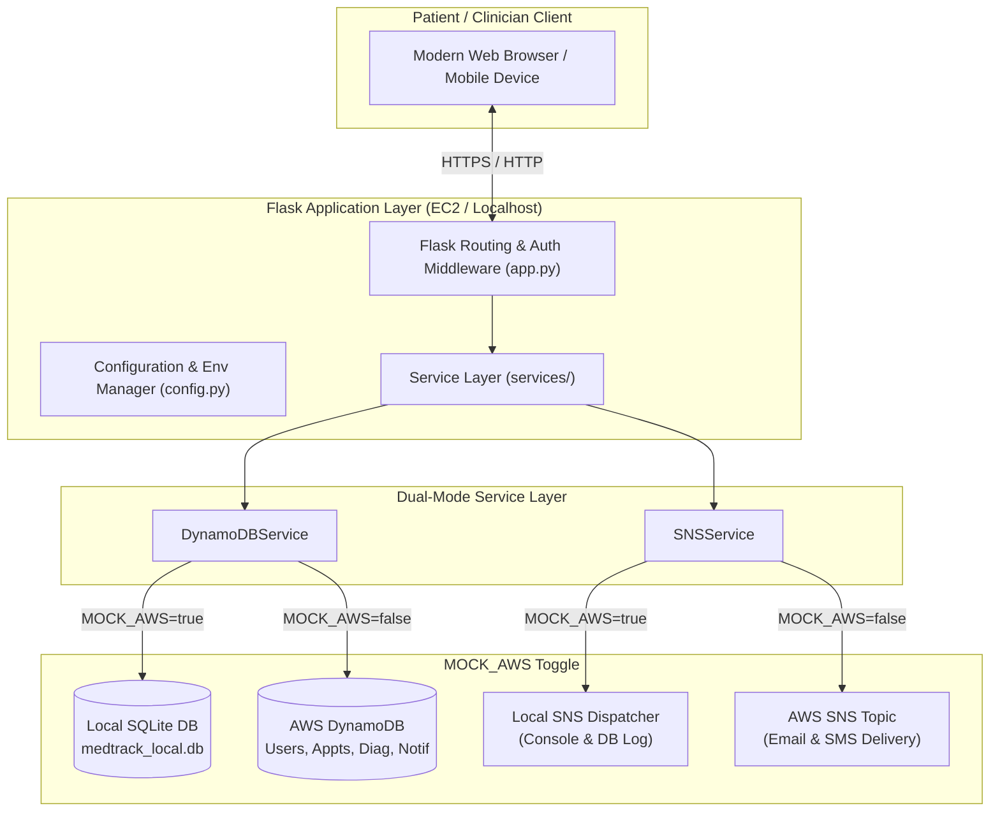
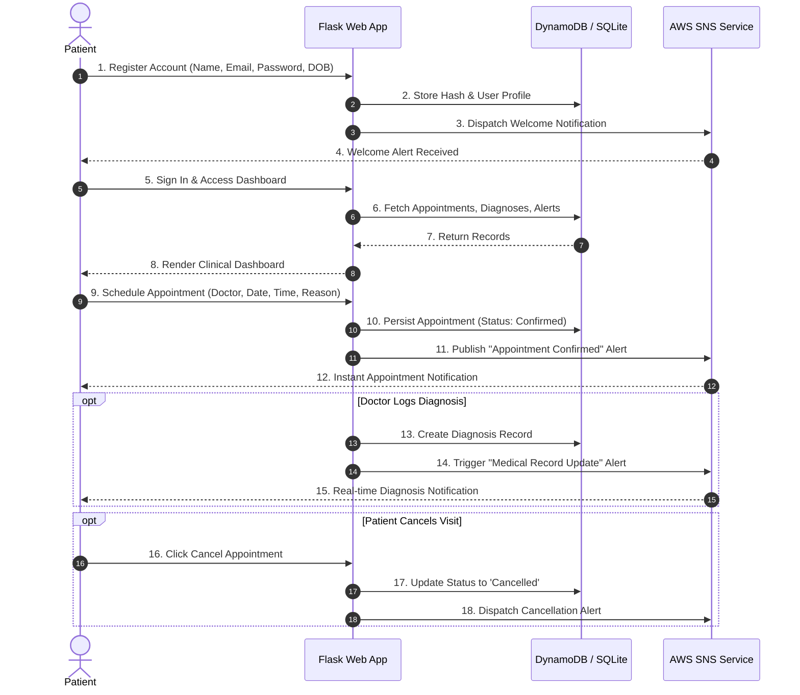
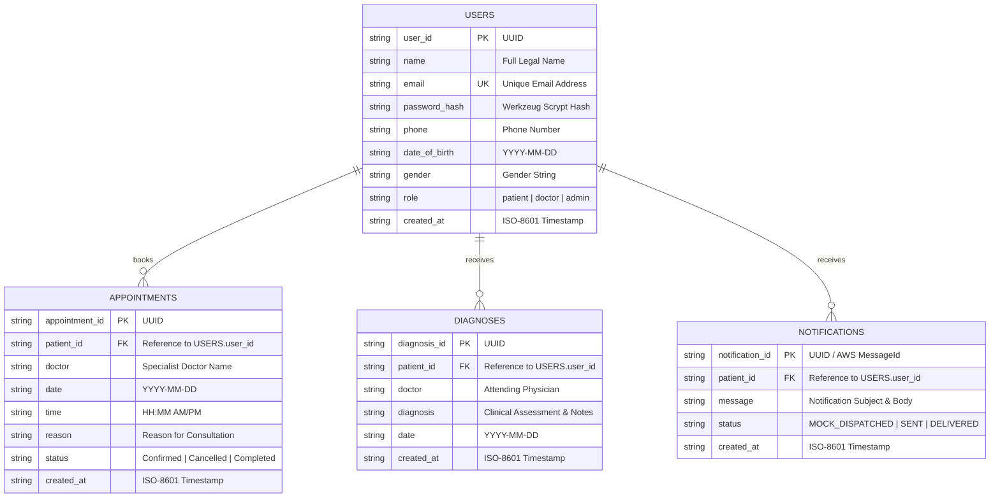

# MedTrack – AWS Cloud-Enabled Healthcare Management System

[](#)
[](#)
[](#)
[](#)
[](#)

> **SkillWallet Capstone Project**  
> **Author / Student:** Johnsen Abraham (<johnsenabraham01@gmail.com>)  
> **Repository:** `MedTrack`

---

## Table of Contents
1. [Project Overview](#project-overview)
2. [Problem Statement](#problem-statement)
3. [Objectives](#objectives)
4. [Key Features](#key-features)
5. [Technology Stack](#technology-stack)
6. [System Architecture](#system-architecture)
7. [Project Workflow](#project-workflow)
8. [Database Design & ER Diagram](#database-design--er-diagram)
9. [Local Development (Mock AWS Mode)](#local-development-mock-aws-mode)
10. [Environment Variables](#environment-variables)
11. [AWS Integration Plan](#aws-integration-plan)
    - [DynamoDB Table Setup](#1-dynamodb-table-setup)
    - [SNS Topic & Subscriptions](#2-sns-topic--subscriptions)
    - [IAM Security & Role Policies](#3-iam-security--role-policies)
    - [EC2 Ubuntu Deployment & Nginx/Gunicorn](#4-ec2-ubuntu-deployment--nginxgunicorn)
12. [Git & GitHub Setup](#git--github-setup)
13. [Verification & Test Results](#verification--test-results)

---

## Project Overview

**MedTrack** is an enterprise-grade, cloud-enabled healthcare management web application designed to modernize the interaction between patients and medical care providers. Built with a scalable Python Flask backend and styled with a contemporary healthcare design system, MedTrack orchestrates appointment booking, electronic health records (diagnoses), and patient communication.

To provide seamless enterprise reliability, MedTrack is engineered for AWS Cloud infrastructure:
- **AWS DynamoDB:** Low-latency, serverless NoSQL database storing users, appointments, diagnoses, and notification histories.
- **AWS SNS (Simple Notification Service):** Asynchronous push messaging engine alerting patients when appointments are confirmed, modified, or when physician notes are posted.
- **AWS IAM:** Granular least-privilege security policies ensuring application servers access only designated cloud resources.
- **AWS EC2:** Production hosting environment running Gunicorn WSGI and Nginx reverse proxy.
- **Local Mock Mode (`MOCK_AWS=true`):** Zero-friction local development mode utilizing a local SQLite data store and SNS console/database simulator, completely eliminating the need for AWS credentials during local engineering.

---

## Problem Statement

Traditional hospital and clinic management workflows frequently suffer from:
1. **Fragmented Patient Portals:** Disconnected systems for scheduling appointments and maintaining clinical records lead to scheduling conflicts and lost medical histories.
2. **Notification Gaps:** Lack of automated, real-time alert dispatching leads to high appointment no-show rates and uninformed patients.
3. **Complex Local Cloud Dependencies:** Traditional cloud architectures make local prototyping and academic assessment cumbersome due to credential requirements and cloud billing risks.
4. **Poor Mobile Adaptability:** Legacy healthcare systems are seldom mobile-optimized, impeding patients from booking or viewing notes on handheld devices.

---

## Objectives

1. **Local-First Cloud Readiness:** Develop an abstracted service architecture allowing 100% functionality locally without cloud credentials, while remaining ready for instant deployment to AWS.
2. **Comprehensive Clinical Lifecycle:** Implement full patient registration, secure password hashing, session management, appointment booking/cancellation, and physician diagnosis history.
3. **Automated Event-Driven Messaging:** Architect an AWS SNS notification pipeline that dispatches alerts whenever critical medical actions occur.
4. **Professional Healthcare UI/UX:** Deliver a modern, accessible, mobile-first interface featuring clinical teal palettes, responsive grids, interactive forms, and clear feedback alerts.
5. **Production Deployment Blueprint:** Formulate detailed setup scripts and IAM policies for AWS DynamoDB, SNS, and EC2 Ubuntu deployment.

---

## Key Features

- **Branded Patient Portal & Landing Hub:** Sleek modern hero landing page highlighting platform benefits, clinical stats, and specialist physician profiles.
- **Secure Authentication & Role Control:** Salted and hashed passwords (`scrypt` / `pbkdf2`), secure cookie-backed Flask sessions, and route authentication wrappers (`@login_required`).
- **Dynamic Patient Dashboard:** Real-time health statistics cards (upcoming visits, total consultations, active diagnoses, alert counts), patient profile metadata, and interactive activity feeds.
- **Appointment Orchestration:** Choose specialist doctors by clinical discipline, select valid future consultation dates, pick available time slots, and cancel appointments on-demand.
- **Electronic Health Records & Diagnoses:** Attending physicians log structured medical assessments, treatment plans, and clinical notes directly into the patient's longitudinal timeline.
- **AWS SNS Dispatch Simulation:** In local development, dispatches are logged to the console and saved to the notifications table with simulated AWS Message IDs. In cloud production, boto3 pushes real emails/SMS to subscribers.

---

## Technology Stack

| Layer | Technologies Used |
| :--- | :--- |
| **Backend Framework** | Python 3.14+, Flask 3.x, Werkzeug (Security & Auth) |
| **Cloud SDK** | AWS `boto3`, `botocore` |
| **Cloud Services** | AWS DynamoDB (NoSQL), AWS SNS (Push Alerts), AWS IAM (RBAC), AWS EC2 |
| **Local Mock Engine** | SQLite 3 (`medtrack_local.db`), Mock SNS Event Dispatcher |
| **Frontend** | Semantic HTML5, Vanilla CSS3 (Custom Healthcare Design System), ES6 JavaScript |
| **Typography & Assets** | Google Fonts (*Plus Jakarta Sans*, *Inter*), CSS Glassmorphism & SVG Icons |
| **Environment Config** | `python-dotenv`, `config.py` |
| **Version Control** | Git, GitHub |

---

## System Architecture



---

## Project Workflow



---

## Database Design & ER Diagram

MedTrack utilizes a document-oriented NoSQL schema optimized for single-table or decoupled multi-table structures in AWS DynamoDB:



---

## Local Development (Mock AWS Mode)

MedTrack runs entirely on your local machine with zero AWS credentials or configuration required.

### 1. Prerequisites
- Python 3.10+ (tested on Python 3.14)
- Git

### 2. Setup Virtual Environment & Install Dependencies
```bash
# Clone the repository (if not already local)
git clone https://github.com/JohnsenAbraham/MedTrack.git
cd MedTrack

# Create Python virtual environment
python -m venv venv

# Activate virtual environment
# On Windows (PowerShell):
.\venv\Scripts\Activate.ps1
# On Windows (Command Prompt):
.\venv\Scripts\activate.bat
# On macOS / Linux:
source venv/bin/activate

# Install dependencies
pip install -r requirements.txt
```

### 3. Initialize Environment Configuration
Copy `.env.example` to `.env`:
```bash
copy .env.example .env
```
Ensure `MOCK_AWS=true` is set inside `.env`.

### 4. Run the Application
```bash
python app.py
```
Open your browser and navigate to:
```
http://127.0.0.1:5000
```

---

## Environment Variables

| Variable | Default Value | Description |
| :--- | :--- | :--- |
| `MOCK_AWS` | `true` | When `true`, uses local SQLite and mock SNS dispatches. When `false`, connects to AWS. |
| `AWS_REGION` | `us-east-1` | AWS Cloud Region for DynamoDB tables and SNS topics. |
| `AWS_ACCESS_KEY_ID` | *Empty* | AWS Access Key ID (leave empty if using EC2 IAM Role). |
| `AWS_SECRET_ACCESS_KEY` | *Empty* | AWS Secret Access Key (leave empty if using EC2 IAM Role). |
| `DYNAMODB_USERS_TABLE` | `MedTrack_Users` | DynamoDB Table Name for User Profiles. |
| `DYNAMODB_APPOINTMENTS_TABLE` | `MedTrack_Appointments` | DynamoDB Table Name for Patient Appointments. |
| `DYNAMODB_DIAGNOSES_TABLE` | `MedTrack_Diagnoses` | DynamoDB Table Name for Medical Diagnoses. |
| `DYNAMODB_NOTIFICATIONS_TABLE` | `MedTrack_Notifications` | DynamoDB Table Name for Notifications. |
| `SNS_TOPIC_ARN` | `arn:aws:sns:...` | AWS SNS Topic ARN for patient notifications. |
| `SECRET_KEY` | *Configured* | Cryptographic secret for Flask session signing. |

---

## AWS Integration Plan

When graduating from local development to live AWS deployment, follow this cloud provisioning blueprint.

### 1. DynamoDB Table Setup

Create the four DynamoDB tables using the AWS CLI or AWS Management Console:

```bash
# 1. Users Table (Partition Key: user_id [String])
aws dynamodb create-table \
    --table-name MedTrack_Users \
    --attribute-definitions AttributeName=user_id,AttributeType=S AttributeName=email,AttributeType=S \
    --key-schema AttributeName=user_id,KeyType=HASH \
    --global-secondary-indexes '[{"IndexName":"EmailIndex","KeySchema":[{"AttributeName":"email","KeyType":"HASH"}],"Projection":{"ProjectionType":"ALL"}}]' \
    --billing-mode PAY_PER_REQUEST \
    --region us-east-1

# 2. Appointments Table (Partition Key: appointment_id [String])
aws dynamodb create-table \
    --table-name MedTrack_Appointments \
    --attribute-definitions AttributeName=appointment_id,AttributeType=S AttributeName=patient_id,AttributeType=S \
    --key-schema AttributeName=appointment_id,KeyType=HASH \
    --global-secondary-indexes '[{"IndexName":"PatientIndex","KeySchema":[{"AttributeName":"patient_id","KeyType":"HASH"}],"Projection":{"ProjectionType":"ALL"}}]' \
    --billing-mode PAY_PER_REQUEST \
    --region us-east-1

# 3. Diagnoses Table (Partition Key: diagnosis_id [String])
aws dynamodb create-table \
    --table-name MedTrack_Diagnoses \
    --attribute-definitions AttributeName=diagnosis_id,AttributeType=S AttributeName=patient_id,AttributeType=S \
    --key-schema AttributeName=diagnosis_id,KeyType=HASH \
    --global-secondary-indexes '[{"IndexName":"PatientIndex","KeySchema":[{"AttributeName":"patient_id","KeyType":"HASH"}],"Projection":{"ProjectionType":"ALL"}}]' \
    --billing-mode PAY_PER_REQUEST \
    --region us-east-1

# 4. Notifications Table (Partition Key: notification_id [String])
aws dynamodb create-table \
    --table-name MedTrack_Notifications \
    --attribute-definitions AttributeName=notification_id,AttributeType=S AttributeName=patient_id,AttributeType=S \
    --key-schema AttributeName=notification_id,KeyType=HASH \
    --global-secondary-indexes '[{"IndexName":"PatientIndex","KeySchema":[{"AttributeName":"patient_id","KeyType":"HASH"}],"Projection":{"ProjectionType":"ALL"}}]' \
    --billing-mode PAY_PER_REQUEST \
    --region us-east-1
```

---

### 2. SNS Topic & Subscriptions

```bash
# 1. Create the SNS Topic
aws sns create-topic --name MedTrack-Alerts --region us-east-1

# 2. Subscribe an Email Address to the Topic for testing alerts
aws sns subscribe \
    --topic-arn "arn:aws:sns:us-east-1:YOUR_ACCOUNT_ID:MedTrack-Alerts" \
    --protocol email \
    --notification-endpoint "johnsenabraham01@gmail.com"

# 3. Confirm the subscription by clicking the link in the verification email sent by AWS.
```

---

### 3. IAM Security & Role Policies

Never embed permanent AWS access keys on an EC2 instance. Instead, create an **IAM Role** with an **Instance Profile** attached to your EC2 instance.

**IAM Policy JSON (`MedTrackEC2Policy`):**
```json
{
  "Version": "2012-10-17",
  "Statement": [
    {
      "Sid": "DynamoDBTableAccess",
      "Effect": "Allow",
      "Action": [
        "dynamodb:PutItem",
        "dynamodb:GetItem",
        "dynamodb:UpdateItem",
        "dynamodb:Query",
        "dynamodb:Scan"
      ],
      "Resource": [
        "arn:aws:dynamodb:us-east-1:*:table/MedTrack_*"
      ]
    },
    {
      "Sid": "SNSPublishAccess",
      "Effect": "Allow",
      "Action": [
        "sns:Publish"
      ],
      "Resource": [
        "arn:aws:sns:us-east-1:*:MedTrack-Alerts"
      ]
    }
  ]
}
```

Attach this policy to an IAM Role named `MedTrack-EC2-AppRole` and assign the role to your EC2 server.

---

### 4. EC2 Ubuntu Deployment & Nginx/Gunicorn

1. **Launch EC2 Instance:** Ubuntu 22.04 LTS or 24.04 LTS (t3.micro or t3.small) with Security Group allowing ports 22 (SSH), 80 (HTTP), and 443 (HTTPS).
2. **Attach IAM Role:** Attach `MedTrack-EC2-AppRole` to the instance.
3. **Provision the Server:**
   ```bash
   sudo apt update && sudo apt upgrade -y
   sudo apt install -y python3-pip python3-venv nginx git

   # Clone Project
   git clone https://github.com/JohnsenAbraham/MedTrack.git /var/www/medtrack
   cd /var/www/medtrack

   # Create virtualenv and install packages
   python3 -m venv venv
   source venv/bin/activate
   pip install -r requirements.txt
   pip install gunicorn

   # Configure Production .env
   cp .env.example .env
   # Edit .env: set MOCK_AWS=false, set AWS_REGION=us-east-1, set SNS_TOPIC_ARN
   ```
4. **Create Systemd Service (`/etc/systemd/system/medtrack.service`):**
   ```ini
   [Unit]
   Description=MedTrack Healthcare Gunicorn Daemon
   After=network.target

   [Service]
   User=ubuntu
   Group=www-data
   WorkingDirectory=/var/www/medtrack
   Environment="PATH=/var/www/medtrack/venv/bin"
   ExecStart=/var/www/medtrack/venv/bin/gunicorn --workers 3 --bind 127.0.0.1:8000 app:app

   [Install]
   WantedBy=multi-user.target
   ```
5. **Configure Nginx Reverse Proxy (`/etc/nginx/sites-available/medtrack`):**
   ```nginx
   server {
       listen 80;
       server_name your-ec2-public-ip-or-domain;

       location / {
           proxy_pass http://127.0.0.1:8000;
           proxy_set_header Host $host;
           proxy_set_header X-Real-IP $remote_addr;
           proxy_set_header X-Forwarded-For $proxy_add_x_forwarded_for;
       }
   }
   ```
6. **Start Services:**
   ```bash
   sudo systemctl enable medtrack
   sudo systemctl start medtrack
   sudo ln -s /etc/nginx/sites-available/medtrack /etc/nginx/sites-enabled/
   sudo systemctl restart nginx
   ```

---

## Git & GitHub Setup

This repository is pre-configured with Git author details:
- **Author Name:** Johnsen Abraham
- **Author Email:** `johnsenabraham01@gmail.com`

### Publishing to GitHub
```bash
# 1. Add all project files
git add .

# 2. Commit initial local release
git commit -m "feat: complete local healthcare management web application with mock AWS services"

# 3. Create a new repository on GitHub named 'MedTrack' under your account
# 4. Link the remote and push
git remote add origin https://github.com/JohnsenAbraham/MedTrack.git
git branch -M main
git push -u origin main
```

---

## Verification & Test Results

The application includes automated and manual tests covering all features:
- Registration with valid data & duplicate email collision prevention.
- Cryptographic password hashing and verification.
- Session authorization and protected route enforcement.
- Appointment scheduling, date constraints, and instant cancellation.
- Clinical diagnosis recording and medical history timelines.
- AWS SNS notification dispatch in simulated local mode.

Run automated tests locally with:
```bash
python -m unittest tests/test_app.py
```
