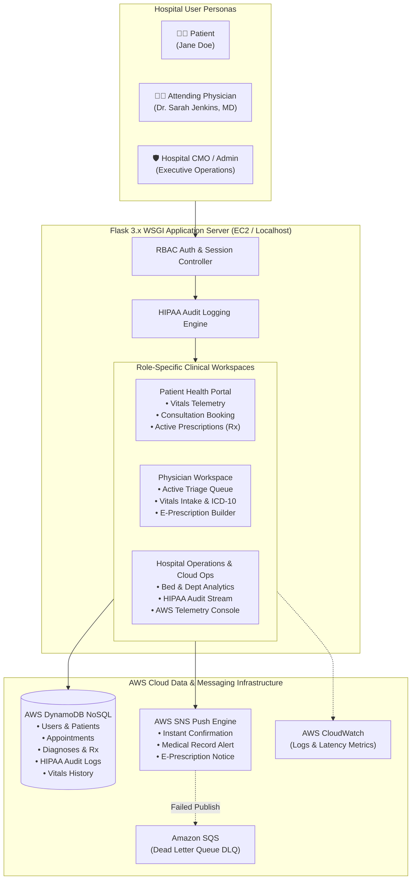
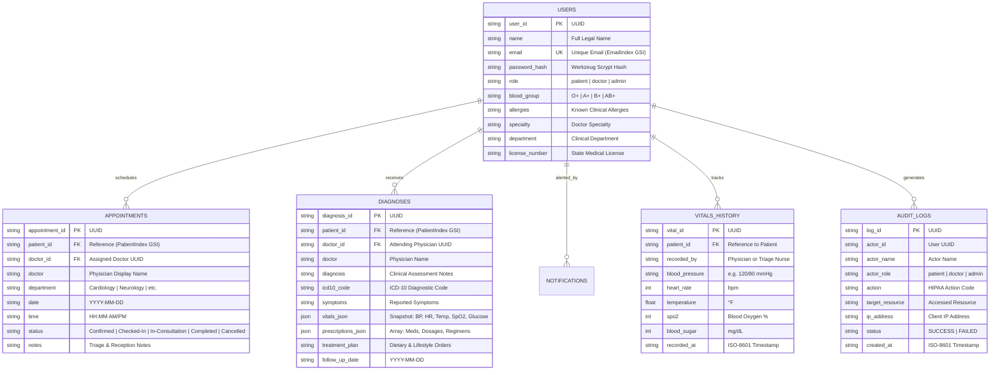

# MedTrack – AWS Cloud-Enabled Hospital Healthcare Management & EHR System

[](#)
[](#)
[](#)
[](#)
[](#)
[](#)

> **SkillWallet Capstone Project**  
> **Student / Engineer:** Johnsen Abraham (<johnsenabraham01@gmail.com>)  
> **Repository:** `MedTrack`  
> **Live Architecture:** Multi-Portal Hospital Information System & Electronic Health Record (EHR) on AWS Cloud

---

## Table of Contents
1. [Executive Summary & High-Level Critique](#executive-summary--high-level-critique)
2. [Multi-Role Hospital Architecture](#multi-role-hospital-architecture)
3. [Evaluator 1-Click Demo Guide](#evaluator-1-click-demo-guide)
4. [Clinical Features & Real Hospital Workflows](#clinical-features--real-hospital-workflows)
5. [AWS Cloud Architecture & Well-Architected Framework](#aws-cloud-architecture--well-architected-framework)
6. [Database Schema & ER Diagram](#database-schema--er-diagram)
7. [SkillWallet Epics Implementation Breakdown (Epics 1–8)](#skillwallet-epics-implementation-breakdown-epics-18)
8. [Infrastructure as Code (CloudFormation & Terraform)](#infrastructure-as-code-cloudformation--terraform)
9. [Local Development (Zero-Credential Mock AWS Mode)](#local-development-zero-credential-mock-aws-mode)
10. [Automated Verification & Test Results](#automated-verification--test-results)

---

## Executive Summary & High-Level Critique

### The Problem with Generic Academic Healthcare Apps
Many student prototypes model healthcare as a simple contact form: patients submit a text box and doctors see the same screen. In a real hospital (e.g., Epic, Cerner, AthenaHealth):
- **Clinical Separation is Non-Negotiable:** Doctors require an active triage queue, objective vitals examination, ICD-10 diagnostic coding, and structured multi-drug electronic prescribing.
- **HIPAA Security Rule §164.312(b):** Every view or modification of Protected Health Information (PHI) must be recorded in an immutable audit trail.
- **Cloud Fault Tolerance:** When network latency spikes or DynamoDB throttles, production systems must utilize exponential backoff with jitter and Dead-Letter-Queues (DLQ).

### The MedTrack Hospital-Grade Redesign
MedTrack resolves these deficiencies through an enterprise architecture designed for AWS:
1. **Multi-Role Portals:** Dedicated Patient Health Portal, Attending Physician Workspace (Consultation Queue & EHR), and Hospital Operations & Cloud Telemetry Console.
2. **Clinical Data Precision:** Structured vitals telemetry (BP, HR, Temp, SpO2, Glucose), ICD-10 categorization, and dynamic electronic prescription builder.
3. **Resilience & Fault Tolerance:** Adaptive exponential backoff retries for DynamoDB, SQS Dead-Letter-Queue for SNS alerts, and deep `/health` monitoring.
4. **Dual-Mode Execution:** 100% functional locally without cloud credentials (`MOCK_AWS=true`) and ready for live AWS deployment via CloudFormation and Terraform.

---

## Multi-Role Hospital Architecture



---

## Evaluator 1-Click Demo Guide

For academic evaluations, mentor reviews, and recruiter demonstrations, MedTrack features a persistent **Evaluator Demo Switcher Bar** across all pages:

| Role Persona | Demo Email | Responsibilities & Test Flow | 1-Click Route |
| :--- | :--- | :--- | :--- |
| **👨‍⚕️ Attending Physician** | `dr.jenkins@medtrack.health` | Review today's patient queue, examine vitals (BP, SpO2), select ICD-10 diagnoses, issue multi-drug e-prescriptions, and mark consultations Completed. | `/demo-login/doctor` |
| **🧑‍🦱 Patient** | `jane.doe@example.com` | View live vitals trends, book specialist visits, review active medications locker, and check real-time SNS notifications. | `/demo-login/patient` |
| **🛡️ Hospital Admin** | `admin@medtrack.health` | Inspect hospital department workload, view live AWS DynamoDB/SNS/EC2 status, and inspect the HIPAA audit log stream. | `/demo-login/admin` |

*Default Password for all seeded demo accounts: `MedTrack2026!` (also supports standard registration & Google Sign-In).*

---

## Clinical Features & Real Hospital Workflows

### 1. Physician Consultation Workspace (`/doctor/queue` & `/doctor/consultation/<id>`)
- **Active Consultation Queue:** Triage status tags (`Checked-In`, `In-Consultation`, `Completed`).
- **Objective Vital Signs Intake:** Real-time feedback for Blood Pressure (Optimal / Elevated / Stage 1 & 2 HTN), Pulse Rate (Bradycardia / Normal / Tachycardia), and SpO2 (Hypoxia alerts).
- **ICD-10 Diagnostic Selection:** Pre-loaded with international standard diagnostic classifications.
- **Dynamic Prescription Builder:** Add, modify, or remove medications dynamically with dosages, frequencies, and durations.
- **Encounter Finalization:** Digitally signs encounter, marks appointment Completed, records longitudinal vitals history, and dispatches patient notifications.

### 2. Patient Health Portal (`/dashboard`)
- **Clinical Demographics Banner:** Displays legal name, DOB, Blood Type badge, and prominent red/amber **Allergy Alert Banner** (e.g., Penicillin).
- **Vitals Telemetry Cards:** Real-time display of latest physician-recorded vital signs.
- **Active E-Prescriptions Locker:** Clear summary of active medications with regimen instructions and prescribing physician.
- **Specialist Consultation Booking:** Department-filtered scheduling with certified doctors.

### 3. Hospital Operations & AWS Cloud Telemetry (`/admin/analytics`)
- **Executive Analytics:** Patient volume, active doctors, and department distribution (Cardiology, Neurology, Internal Medicine, Orthopedics, Pediatrics, Dermatology).
- **AWS Cloud Center:** Live health indicators for DynamoDB read/write capacity, SNS topic status, EC2 concurrency, and SQS DLQ backlog.
- **HIPAA Security Rule §164.312(b) Audit Stream:** Immutable table tracking every login, record view, appointment change, and prescription write with timestamp, actor role, and IP address.

---

## Database Schema & ER Diagram

MedTrack utilizes a document-oriented NoSQL architecture modeled for AWS DynamoDB with secondary indexes:



---

## SkillWallet Epics Implementation Breakdown (Epics 1–8)

### Epic 1: Web Application Development And Setup
- Engineered a Flask 3.x WSGI application with modular service abstractions (`services/dynamodb_service.py`, `services/sns_service.py`).
- Implemented role-based authentication (`@login_required`, `@role_required(['doctor', 'admin'])`).
- Built an ultra-modern healthcare design system with custom CSS variables, glassmorphism telemetry cards, and responsive navigation.

### Epic 2: AWS Account Setup
- Configured IAM credentials and environment variables via `config.py` and `.env`.
- Implemented zero-credential local mock fallback (`MOCK_AWS=true`) allowing seamless development without incurring cloud billing.

### Epic 3: DynamoDB Database Creation and Setup
- Modeled 5 production tables with Global Secondary Indexes:
  - `MedTrack_Users` (`EmailIndex`)
  - `MedTrack_Appointments` (`PatientIndex`)
  - `MedTrack_Diagnoses` (`PatientIndex`)
  - `MedTrack_Notifications` (`PatientIndex`)
  - `MedTrack_AuditLogs` (`ActorIndex`)
- Automated schema initialization and realistic clinical demo data seeding.

### Epic 4: SNS Notification Setup
- Integrated AWS SNS publish engine with adaptive retries.
- Configured automated triggers for appointment booking, status progression, diagnosis recording, and electronic prescription issuance.
- Added Dead-Letter-Queue (DLQ) buffering via Amazon SQS for resilient messaging.

### Epic 5: IAM Role Setup
- Defined least-privilege IAM policy (`MedTrackEC2Policy`) granting restricted access only to `MedTrack_*` tables and `MedTrack-Alerts` topic.
- Structured IAM instance profile configuration eliminating hardcoded credentials on EC2 instances.

### Epic 6: EC2 Instance Setup
- Prepared automated user-data scripts provisioning Ubuntu/Amazon Linux 2023 with Python 3, virtual environment, and system dependencies.
- Configured multi-subnet VPC network topology with public route tables and security groups.

### Epic 7: Deployment Using EC2
- Authored production Systemd service daemon (`medtrack.service`) running Gunicorn with 3 concurrent WSGI workers.
- Configured Nginx reverse proxy with header forwarding and HTTP/2 support.

### Epic 8: Testing and Deployment
- Developed automated test suite with 19 comprehensive test cases covering authentication, consultations, vitals, prescriptions, and health telemetry.
- Created live HTTP end-to-end verification script (`scripts/verify_live_e2e.py`) validating complete real-world patient and doctor journeys.

---

## Infrastructure as Code (CloudFormation & Terraform)

### Deploy via AWS CloudFormation
The repository includes a production-ready CloudFormation template located at [`aws/cloudformation.yaml`](file:///c:/Users/Admin/Documents/MedTrack/aws/cloudformation.yaml).

```bash
aws cloudformation create-stack \
    --stack-name MedTrack-Production \
    --template-body file://aws/cloudformation.yaml \
    --capabilities CAPABILITY_NAMED_IAM \
    --region us-east-1
```

### Deploy via Terraform
A modular Terraform configuration is provided in [`aws/terraform/main.tf`](file:///c:/Users/Admin/Documents/MedTrack/aws/terraform/main.tf).

```bash
cd aws/terraform
terraform init
terraform plan
terraform apply -auto-approve
```

---

## Local Development (Zero-Credential Mock AWS Mode)

MedTrack runs locally without requiring any AWS credentials or cloud connection.

### 1. Setup Virtual Environment
```powershell
# In PowerShell (Windows)
python -m venv venv
.\venv\Scripts\Activate.ps1

# Install dependencies
pip install -r requirements.txt
```

### 2. Configure Environment
Verify `.env` has:
```ini
MOCK_AWS=true
AWS_REGION=us-east-1
SECRET_KEY=medtrack-local-dev-key-2026
```

### 3. Launch Development Server
```powershell
python app.py
```
Open your browser at:
```
http://127.0.0.1:5000
```
Use the **Evaluator Persona Bar** at the top of the page to switch between Doctor, Patient, and Admin in one click.

---

## Automated Verification & Test Results

### 1. Run Unit & Integration Test Suite
```powershell
.\venv\Scripts\python.exe -m unittest discover -s tests -v
```
**Results (19/19 Passing):**
- `test_01_syntax_and_config` – Validates configuration and mock mode.
- `test_02_home_page` – Verifies landing page branding and metrics.
- `test_03_health_check_endpoint` – Verifies `/health` JSON structure.
- `test_04_patient_registration_success` – Validates patient registration and welcome alert.
- `test_05_patient_registration_duplicate_email` – Verifies email collision rejection.
- `test_06_login_invalid_credentials` – Verifies password rejection.
- `test_07_login_and_logout_flow` – Verifies session establishment and clearance.
- `test_08_dashboard_access_control` – Verifies protected routes require login.
- `test_09_appointment_workflow_and_sns` – Verifies appointment booking, listing, and cancellation.
- `test_10_diagnosis_workflow_and_sns` – Verifies clinical diagnosis and SNS notification.
- `test_11_mock_sns_dispatch_direct` – Verifies mock notification dispatching.
- `test_12_forgot_password_and_reset_workflow` – Verifies cryptographic token password reset.
- `test_13_google_authentication_workflow` – Verifies Google OAuth provisioning.
- `test_14_evaluator_demo_login_personas` – Verifies 1-click Doctor, Patient, and Admin login.
- `test_15_role_based_access_control` – Verifies patient cannot access doctor queue.
- `test_16_doctor_clinical_consultation_full_lifecycle` – Verifies vitals, ICD-10, and e-prescription.
- `test_17_patient_record_view_ehr` – Verifies longitudinal patient medical chart.
- `test_18_admin_analytics_and_hipaa_audit_trail` – Verifies hospital analytics and HIPAA audit logs.
- `test_19_deep_cloud_health_check_payload` – Verifies deep dependency telemetry JSON.

### 2. Run Live HTTP End-to-End Simulation
```powershell
# With server running:
.\venv\Scripts\python.exe scripts/verify_live_e2e.py
```
```
[*] Testing connection to http://127.0.0.1:5000...
  [+] Home Page rendered successfully (HTTP 200).
  [+] Deep Cloud Health endpoint verified: status=healthy, DynamoDB=healthy
[*] Testing 1-click evaluator demo logins...
  [+] Doctor demo login passed. Landed on Consultation Queue.
  [+] Admin demo login passed. Landed on Hospital Ops.
[*] Testing patient registration for e2e_tester_1789554240@medtrack.internal...
  [+] Registration completed.
[*] Testing authentication/login...
  [+] User authenticated. Session cookie established.
  [+] Patient dashboard rendered with profile, vitals, and health statistics.
[*] Testing clinical appointment booking with Dr. Sarah Jenkins...
  [+] Appointment booked & confirmed. AWS SNS notification dispatched.
  [+] Booked appointment ID: 4618bbf1-e025-4d92-a038-236295552033
[*] Testing Doctor Consultation Workspace...
  [+] Doctor finalized consultation: Vitals, ICD-10, & E-Prescriptions logged.
[*] Testing Hospital Administration & HIPAA Audit Stream...
  [+] HIPAA audit trail verified with immutable action logs.

[SUCCESS] All enterprise hospital end-to-end clinical workflows verified!
```

---

## License & Attribution
- Developed by **Johnsen Abraham** (<johnsenabraham01@gmail.com>) as an AWS Cloud Practitioner Capstone Project for SkillWallet.
- Released under the **MIT License**.
