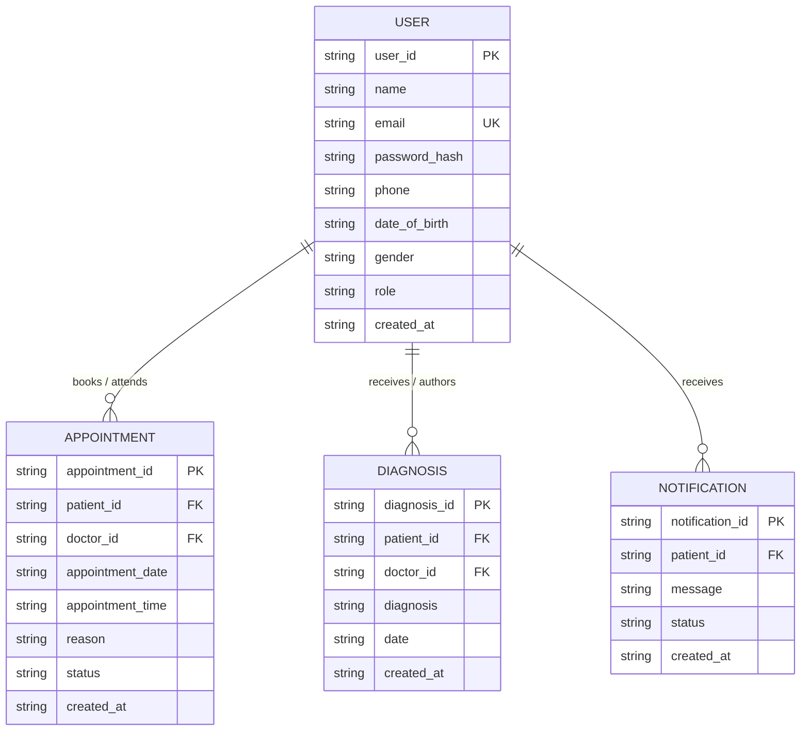

# MedTrack – AWS Cloud-Enabled Healthcare Management System

> **AWS Cloud Practitioner / SkillWallet College Project**  
> *Student demonstration web application showcasing Python Flask, Amazon DynamoDB, Amazon SNS, AWS EC2, and IAM instance roles.*  
> **Notice:** *This is an academic demonstration project utilizing synthetic/demo patient data only. It is not intended for production clinical use.*

---

## Table of Contents
1. [Project Title](#1-project-title)
2. [Problem Statement](#2-problem-statement)
3. [Objectives](#3-objectives)
4. [Features](#4-features)
5. [User Roles](#5-user-roles)
6. [Technology Stack](#6-technology-stack)
7. [Architecture](#7-architecture)
8. [Database Design](#8-database-design)
9. [ER Diagram](#9-er-diagram)
10. [Local Installation](#10-local-installation)
11. [Virtual Environment Setup](#11-virtual-environment-setup)
12. [Environment Variables](#12-environment-variables)
13. [Running the Application](#13-running-the-application)
14. [Testing](#14-testing)
15. [AWS Architecture](#15-aws-architecture)
16. [DynamoDB Setup](#16-dynamodb-setup)
17. [SNS Setup](#17-sns-setup)
18. [IAM Setup](#18-iam-setup)
19. [EC2 Deployment](#19-ec2-deployment)
20. [GitHub Deployment Instructions](#20-github-deployment-instructions)

---

## 1. Project Title
**MedTrack – AWS Cloud-Enabled Healthcare Management System**

---

## 2. Problem Statement
Traditional paper-based and siloed outpatient scheduling systems create communication bottlenecks between patients and clinical practitioners. Appointment delays, lost diagnostic notes, and lack of real-time status notifications lead to missed consultations and administrative overhead. Healthcare management requires a scalable, secure, and event-driven cloud architecture to connect patients with consulting physicians while safeguarding confidential health information.

---

## 3. Objectives
- Develop a full-stack healthcare web application using **Python 3** and **Flask**.
- Implement a two-tier role-based access model for **Patients** and **Doctors**.
- Enable real-time appointment booking, doctor confirmations, and diagnostic record tracking.
- Build a service abstraction layer supporting **Local Mode (SQLite)** for offline development and **AWS Mode (DynamoDB + SNS)** for cloud deployment.
- Integrate **Amazon SNS** to publish notifications for key clinical events.
- Enforce AWS security best practices utilizing **IAM instance roles** rather than hardcoded credentials.

---

## 4. Features
- **Modern Landing Page**: Clean MedTrack branding, system explanation, and feature overviews.
- **Patient Registration & Login**: Input validation, duplicate email prevention, and Werkzeug password hashing.
- **Appointment Scheduling**: Patients select doctor, consultation date, time slot, and provide chief complaints.
- **Doctor Consultation Console**: Physicians review assigned appointments, confirm visits, or complete appointments.
- **Clinical Diagnosis Records**: Attending physicians log diagnosis findings and recommendations; patients securely view their personal medical history.
- **Event-Driven Notifications**: Automated alerts for booking, confirmation, cancellation, and diagnosis recording.
- **Evaluator Quick Login**: 1-click demo role switcher to test Patient and Doctor workflows without typing passwords.

---

## 5. User Roles

### Patient
- Register a new patient account with name, email, phone, date of birth, and gender.
- Authenticate and manage session securely.
- View personal patient dashboard with upcoming and previous appointments.
- Book appointments by selecting an attending doctor, date, time, and reason.
- View and cancel active appointments.
- Access personal clinical diagnosis history.
- Review notification status feed.

### Doctor
- Sign in with verified physician credentials.
- View real-time schedule of assigned patient appointments.
- Update appointment states: `CONFIRMED`, `COMPLETED`, `CANCELLED`.
- Submit clinical diagnoses and treatment instructions for completed consultations.
- Access relevant patient information for assigned visits.

---

## 6. Technology Stack
- **Backend Framework**: Python 3, Flask, Jinja2 Templates
- **Frontend / UI**: HTML5, Vanilla CSS, JavaScript (ES6), Google Fonts (*Plus Jakarta Sans* & *Inter*)
- **Local Storage**: SQLite 3 (for offline development and zero AWS cost)
- **Cloud Database**: Amazon DynamoDB (NoSQL key-value store)
- **Cloud Notifications**: Amazon SNS (Simple Notification Service)
- **Cloud Hosting**: AWS EC2 (Elastic Compute Cloud)
- **Security & Auth**: Werkzeug password hashing, HttpOnly session cookies, AWS IAM Instance Roles
- **AWS SDK**: Boto3 (Python AWS SDK)

---

## 7. Architecture
MedTrack implements a layered service abstraction:
```
Client Browser (Patient / Doctor)
       │
       ▼ (HTTP / HTTPS)
AWS EC2 Instance (Flask Web Application)
       │
       ▼
Service Abstraction Layer (services/database.py & services/sns_service.py)
       │
       ├── Local Mode (MOCK_AWS=true)  ──► SQLite (medtrack_local.db) + Console Logger
       │
       └── AWS Mode (MOCK_AWS=false)   ──► Amazon DynamoDB + Amazon SNS
```

---

## 8. Database Design
The application utilizes four core entities:

| Table Name | Partition Key (PK) | Key Attributes |
|---|---|---|
| **MedTrack_Users** | `user_id` (String) | `name`, `email` (Unique), `password_hash`, `phone`, `date_of_birth`, `gender`, `role` (`patient`/`doctor`), `created_at` |
| **MedTrack_Appointments** | `appointment_id` (String) | `patient_id`, `doctor_id`, `appointment_date`, `appointment_time`, `reason`, `status`, `created_at` |
| **MedTrack_Diagnoses** | `diagnosis_id` (String) | `patient_id`, `doctor_id`, `diagnosis`, `date`, `created_at` |
| **MedTrack_Notifications** | `notification_id` (String) | `patient_id`, `message`, `status`, `created_at` |

---

## 9. ER Diagram


*Detailed entity descriptions available in [`docs/ER-Diagram.md`](docs/ER-Diagram.md).*

---

## 10. Local Installation
Clone the repository to your local workstation:
```bash
git clone https://github.com/your-username/MedTrack.git
cd MedTrack
```

---

## 11. Virtual Environment Setup

### Windows (PowerShell):
```powershell
python -m venv venv
.\venv\Scripts\Activate.ps1
pip install -r requirements.txt
```

### Linux / macOS:
```bash
python3 -m venv venv
source venv/bin/activate
pip install -r requirements.txt
```

---

## 12. Environment Variables
Copy `.env.example` to create your local `.env` configuration:
```bash
cp .env.example .env
```
Default `.env` settings for Phase 1 local development:
```ini
MOCK_AWS=true
AWS_REGION=us-east-1
DYNAMODB_USERS_TABLE=MedTrack_Users
DYNAMODB_APPOINTMENTS_TABLE=MedTrack_Appointments
DYNAMODB_DIAGNOSES_TABLE=MedTrack_Diagnoses
DYNAMODB_NOTIFICATIONS_TABLE=MedTrack_Notifications
SNS_TOPIC_ARN=arn:aws:sns:us-east-1:123456789012:MedTrack_Alerts
SECRET_KEY=medtrack-college-demo-secret-key-2026
```

---

## 13. Running the Application
Start the Flask development server:
```bash
python app.py
```
Open your browser and navigate to:
```
http://127.0.0.1:5000/
```
The application will automatically seed initial demo doctors (`Dr. Marcus Vance` and `Dr. Emily Chen`) in local mode.

---

## 14. Testing
MedTrack includes an automated unit test suite covering all 16 required functional scenarios:
```bash
python -m unittest discover -s tests -v
```
**Test Coverage Includes:**
1. Home page rendering & navigation
2. Patient registration success
3. Duplicate registration prevention
4. Login authentication & session creation
5. Invalid credentials rejection
6. Logout session clearance
7. Patient dashboard widgets & metrics
8. Appointment creation workflow
9. Appointment listing
10. Appointment cancellation
11. Doctor dashboard access
12. Doctor appointment confirmation
13. Clinical diagnosis submission
14. Patient diagnosis viewing
15. Cross-patient unauthorized record access prevention
16. Mock Amazon SNS notification dispatch

---

## 15. AWS Architecture
When deployed to AWS:
- **Amazon EC2**: Runs an Amazon Linux 2023 instance hosting Flask behind Nginx and Gunicorn.
- **AWS IAM**: EC2 instance profile assumes an IAM role granting least-privilege permissions to DynamoDB and SNS without access keys.
- **Amazon DynamoDB**: Manages high-performance NoSQL tables for users, appointments, diagnoses, and notifications.
- **Amazon SNS**: Broadcasts email and SMS notifications when appointments are booked, confirmed, cancelled, or diagnosed.

*Detailed architectural specifications available in [`docs/architecture.md`](docs/architecture.md).*

---

## 16. DynamoDB Setup
When transitioning to AWS (`MOCK_AWS=false`), create the 4 DynamoDB tables via AWS CLI or Management Console:
```bash
# 1. Users Table
aws dynamodb create-table \
    --table-name MedTrack_Users \
    --attribute-definitions AttributeName=user_id,AttributeType=S \
    --key-schema AttributeName=user_id,KeyType=HASH \
    --billing-mode PAY_PER_REQUEST

# 2. Appointments Table
aws dynamodb create-table \
    --table-name MedTrack_Appointments \
    --attribute-definitions AttributeName=appointment_id,AttributeType=S \
    --key-schema AttributeName=appointment_id,KeyType=HASH \
    --billing-mode PAY_PER_REQUEST

# 3. Diagnoses Table
aws dynamodb create-table \
    --table-name MedTrack_Diagnoses \
    --attribute-definitions AttributeName=diagnosis_id,AttributeType=S \
    --key-schema AttributeName=diagnosis_id,KeyType=HASH \
    --billing-mode PAY_PER_REQUEST

# 4. Notifications Table
aws dynamodb create-table \
    --table-name MedTrack_Notifications \
    --attribute-definitions AttributeName=notification_id,AttributeType=S \
    --key-schema AttributeName=notification_id,KeyType=HASH \
    --billing-mode PAY_PER_REQUEST
```

---

## 17. SNS Setup
1. Create the Amazon SNS standard topic:
   ```bash
   aws sns create-topic --name MedTrack_Alerts
   ```
2. Subscribe an email address to receive notifications:
   ```bash
   aws sns subscribe \
       --topic-arn arn:aws:sns:us-east-1:YOUR_ACCOUNT_ID:MedTrack_Alerts \
       --protocol email \
       --notification-endpoint student@example.com
   ```
3. Check your email inbox and click **Confirm subscription**.
4. Update `SNS_TOPIC_ARN` in your production `.env` file.

---

## 18. IAM Setup
1. Create an IAM Role named `MedTrack-EC2-Role` with trusted entity `ec2.amazonaws.com`.
2. Attach an inline policy granting permissions to DynamoDB and SNS:
   ```json
   {
     "Version": "2012-10-17",
     "Statement": [
       {
         "Effect": "Allow",
         "Action": [
           "dynamodb:GetItem",
           "dynamodb:PutItem",
           "dynamodb:UpdateItem",
           "dynamodb:Scan",
           "dynamodb:Query"
         ],
         "Resource": "arn:aws:dynamodb:*:*:table/MedTrack_*"
       },
       {
         "Effect": "Allow",
         "Action": ["sns:Publish"],
         "Resource": "arn:aws:sns:*:*:MedTrack_Alerts"
       }
     ]
   }
   ```
3. Attach this IAM Role to your EC2 instance via **Actions &rarr; Security &rarr; Modify IAM role**.

---

## 19. EC2 Deployment
1. Launch an `t2.micro` or `t3.micro` EC2 instance running Amazon Linux 2023.
2. Configure the Security Group to allow inbound traffic on Port 80 (HTTP), Port 443 (HTTPS), and Port 22 (SSH).
3. Connect via SSH:
   ```bash
   ssh -i your-key.pem ec2-user@your-ec2-public-ip
   ```
4. Install dependencies:
   ```bash
   sudo dnf update -y
   sudo dnf install python3 python3-pip git -y
   ```
5. Clone repository and install requirements:
   ```bash
   git clone https://github.com/your-username/MedTrack.git
   cd MedTrack
   python3 -m venv venv
   source venv/bin/activate
   pip install -r requirements.txt
   ```
6. Set `MOCK_AWS=false` in your `.env` file.
7. Run using Gunicorn or systemd service:
   ```bash
   gunicorn -w 4 -b 0.0.0.0:5000 app:app
   ```

---

## 20. GitHub Deployment Instructions
1. Initialize local git repository:
   ```bash
   git init
   git add .
   git commit -m "feat: initial release of MedTrack AWS Healthcare System"
   ```
2. Link your GitHub repository:
   ```bash
   git branch -M main
   git remote add origin https://github.com/your-username/MedTrack.git
   ```
3. Push codebase to GitHub:
   ```bash
   git push -u origin main
   ```
*Ensure `.env` and `*.db` remain ignored by `.gitignore` to prevent committing secrets.*

---

## License & Academic Disclaimer
This project was developed solely as an academic demonstration for the **AWS Cloud Practitioner / SkillWallet** evaluation. All patient and medical data is synthetic. Not for commercial or medical deployment.
