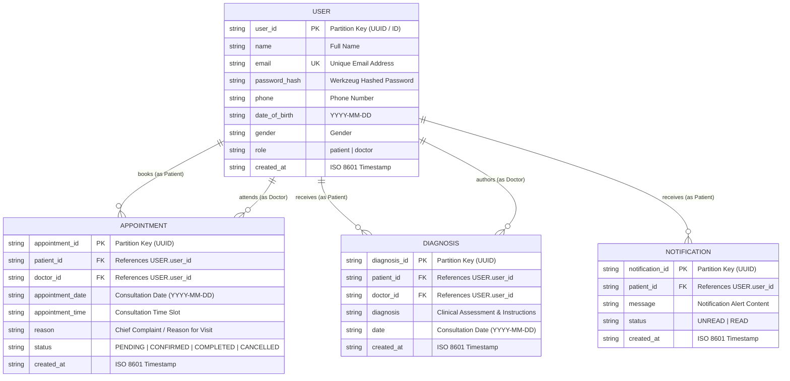

# MedTrack Database Model & Entity-Relationship (ER) Diagram

## 1. Overview
The MedTrack database architecture is designed to support both local development (via a local SQLite repository) and AWS production deployment (via Amazon DynamoDB NoSQL tables). The data model revolves around the **USER** entity (specialized into **PATIENT** and **DOCTOR** roles), managing clinical appointments, diagnostic records, and notification dispatches.

---

## 2. Mermaid Entity-Relationship Diagram

---

## 3. Entity Definitions & Key Attributes

### `USERS` Table
Stores authentication credentials, contact details, and role assignments for all system users.
- **Partition Key**: `user_id` (String, unique identifier).
- **Attributes**:
  - `name`: User's full name.
  - `email`: User's registered email address (unique).
  - `password_hash`: Cryptographically hashed password using Werkzeug (`scrypt` / `pbkdf2`).
  - `phone`: Contact telephone number.
  - `date_of_birth`: Date of birth (`YYYY-MM-DD`).
  - `gender`: Gender (`Male`, `Female`, `Other`).
  - `role`: Role indicator (`patient` or `doctor`).
  - `created_at`: Account creation timestamp (ISO 8601 UTC).

### `APPOINTMENTS` Table
Represents scheduled clinical visits between a registered patient and an attending doctor.
- **Partition Key**: `appointment_id` (String, unique identifier).
- **Attributes**:
  - `patient_id`: Foreign key referencing `USERS.user_id` of the patient.
  - `doctor_id`: Foreign key referencing `USERS.user_id` of the attending doctor.
  - `appointment_date`: Scheduled date (`YYYY-MM-DD`).
  - `appointment_time`: Scheduled time slot (e.g., `10:00 AM`).
  - `reason`: Reason for visit / chief clinical symptoms.
  - `status`: Current state (`PENDING`, `CONFIRMED`, `COMPLETED`, `CANCELLED`).
  - `created_at`: Booking creation timestamp (ISO 8601 UTC).

### `DIAGNOSES` Table
Stores post-consultation clinical diagnoses, medical observations, and treatment plans.
- **Partition Key**: `diagnosis_id` (String, unique identifier).
- **Attributes**:
  - `patient_id`: Foreign key referencing `USERS.user_id` of the patient.
  - `doctor_id`: Foreign key referencing `USERS.user_id` of the diagnosing physician.
  - `diagnosis`: Comprehensive clinical findings, assessment, and care instructions.
  - `date`: Date of the consultation (`YYYY-MM-DD`).
  - `created_at`: Record creation timestamp (ISO 8601 UTC).

### `NOTIFICATIONS` Table
Stores event-driven alerts dispatched to patients regarding appointment and clinical status updates.
- **Partition Key**: `notification_id` (String, unique identifier).
- **Attributes**:
  - `patient_id`: Foreign key referencing `USERS.user_id` of the recipient.
  - `message`: Text content of the notification.
  - `status`: State of the alert (`UNREAD` / `READ`).
  - `created_at`: Dispatch timestamp (ISO 8601 UTC).

---

## 4. Relationships & Access Boundaries

1. **User Specialization**:
   - A `USER` has exactly one role: `patient` or `doctor`.
   - Patients can create `APPOINTMENT` records and view their own `DIAGNOSIS` and `NOTIFICATION` records.
   - Doctors can view assigned `APPOINTMENT` records, update appointment status, and author `DIAGNOSIS` records.
2. **Access Isolation**:
   - Cross-patient record access is strictly forbidden at the application route level.
   - Patients can only query and view records where `patient_id == session['user_id']`.
   - Doctors can only view appointments where `doctor_id == session['user_id']`.
