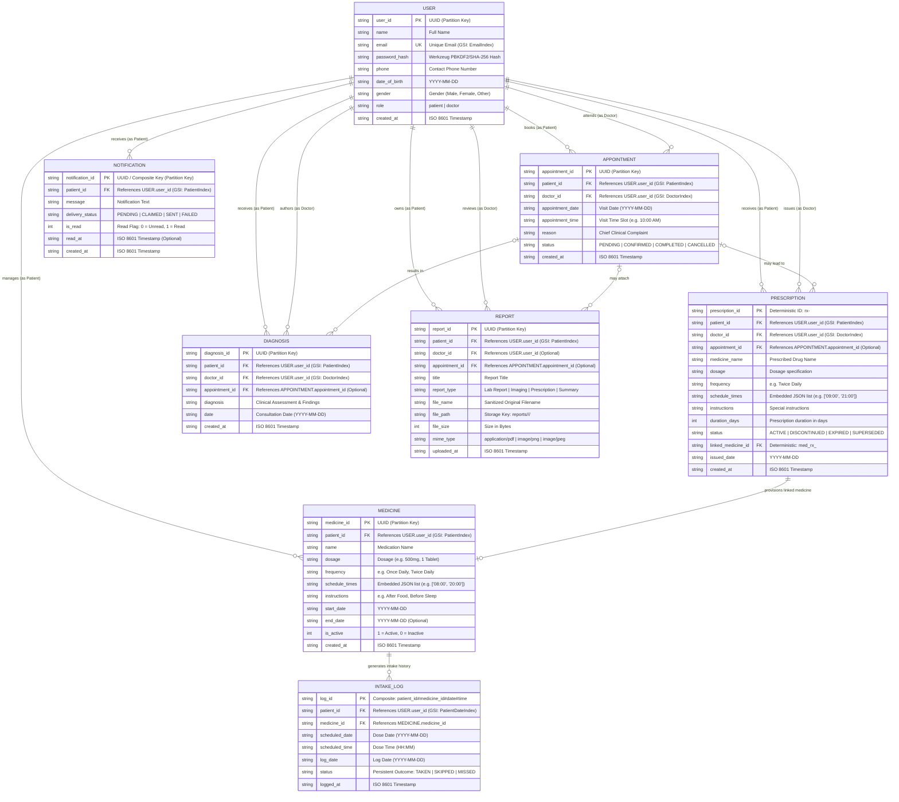

# MedTrack Database Model & Entity-Relationship (ER) Diagram

## 1. Overview
MedTrack employs a dual-tier persistence layer that provides parity between local development (`MOCK_AWS=true` using SQLite in `medtrack_local.db`) and AWS cloud production (`MOCK_AWS=false` using Amazon DynamoDB).

The data model is centered around patient healthcare management, with **Medication Adherence & Intake Tracking** as the core use case, complemented by outpatient appointments, physician consultations, clinical prescriptions, diagnostic reports, and notification alerts.

There are **exactly 8 physical DynamoDB tables** in the production schema. Schedule times are embedded directly inside the `MEDICINE` entity (`schedule_times` JSON list), eliminating unnecessary join complexity. Doctors are represented as `USER` records with `role = "doctor"`. Medical report metadata is stored in the database, while report file binaries are stored in private, server-side encrypted Amazon S3 buckets.

---

## 2. Mermaid Entity-Relationship Diagram

---

## 3. Physical DynamoDB Tables & Global Secondary Indexes (GSIs)

In AWS production, MedTrack provisions **exactly 8 physical DynamoDB tables** with on-demand capacity (`PAY_PER_REQUEST`).

| Table Name | Partition Key (PK) | Sort Key (SK) | Global Secondary Indexes (GSIs) | Purpose |
|---|---|---|---|---|
| **MedTrack_Users** | `user_id` (S) | *None* | `EmailIndex` (`email` S) | Stores patient and physician credentials, contact info, and roles. |
| **MedTrack_Medicines** | `medicine_id` (S) | *None* | `PatientIndex` (`patient_id` S, SK: `created_at` S) | Medication definitions with embedded `schedule_times`. |
| **MedTrack_IntakeLogs** | `log_id` (S) | *None* | `PatientDateIndex` (`patient_id` S, SK: `log_date` S) | Persistent dose outcomes (`TAKEN`, `SKIPPED`, `MISSED`). |
| **MedTrack_Appointments** | `appointment_id` (S) | *None* | `PatientIndex` (`patient_id` S, SK: `appointment_date` S) `DoctorIndex` (`doctor_id` S, SK: `appointment_date` S) | Consultation scheduling and booking lifecycle. |
| **MedTrack_Prescriptions** | `prescription_id` (S) | *None* | `PatientIndex` (`patient_id` S, SK: `issued_date` S) `DoctorIndex` (`doctor_id` S, SK: `issued_date` S) | Physician-issued medication orders linked to active medicines. |
| **MedTrack_Diagnoses** | `diagnosis_id` (S) | *None* | `PatientIndex` (`patient_id` S, SK: `created_at` S) `DoctorIndex` (`doctor_id` S, SK: `created_at` S) | Post-consultation clinical diagnoses and treatment records. |
| **MedTrack_Reports** | `report_id` (S) | *None* | `PatientIndex` (`patient_id` S, SK: `uploaded_at` S) | Diagnostic report metadata (binary file stored in private S3). |
| **MedTrack_Notifications** | `notification_id` (S) | *None* | `PatientIndex` (`patient_id` S, SK: `created_at` S) | System & reminder notifications with delivery lifecycle tracking. |

---

## 4. Key Architectural Data-Model Principles

### 4.1 Embedded Schedules (No Separate Schedule Table)
- Daily intake schedules are stored directly within each `MEDICINE` record as an embedded JSON list in `schedule_times` (e.g., `["08:00", "14:00", "20:00"]`).
- This eliminates join overhead, allows atomic updates, and simplifies time-of-day calculations.
- There is **no physical `Schedule` table** or `ReminderLedger` table.

### 4.2 Runtime States vs. Persistent Outcomes
- **Runtime Virtual States**: `UPCOMING` and `DUE` are dynamically calculated at request time based on the current local time (`APP_TIMEZONE = Asia/Kolkata`), the medication's embedded `schedule_times`, and existing intake logs for that day.
- **Persistent Outcomes**: When a patient acts on a dose or the scheduler records a missed dose, an `INTAKE_LOG` record is written with an immutable outcome:
  - `TAKEN`: Patient confirmed taking the dose.
  - `SKIPPED`: Patient chose to skip the dose.
  - `MISSED`: Scheduled dose window elapsed without patient confirmation.
- `PENDING` is strictly a delivery state for notifications, never a persistent intake state.

### 4.3 Physician Representation (Users with Role = doctor)
- Physicians are stored in `MedTrack_Users` with `role = "doctor"`.
- There is no separate `Doctors` table.
- Doctor isolation is enforced through application authorization: doctors can only view patient records, diagnoses, and reports where an established consultation or appointment exists.

### 4.4 Separation of Medical Report Metadata and Binaries
- The `MedTrack_Reports` table stores report metadata: `title`, `report_type`, `file_name`, `file_path`, `file_size`, and `mime_type`.
- The actual document binary is stored in a private Amazon S3 bucket (`ReportsBucket`) encrypted with AWS SSE-AES256.
- In local development mode (`MOCK_AWS=true`), files are stored locally in `uploads/reports/`.
- Access is gated through authenticated endpoints that generate short-lived (600-second) pre-signed S3 download URLs.
