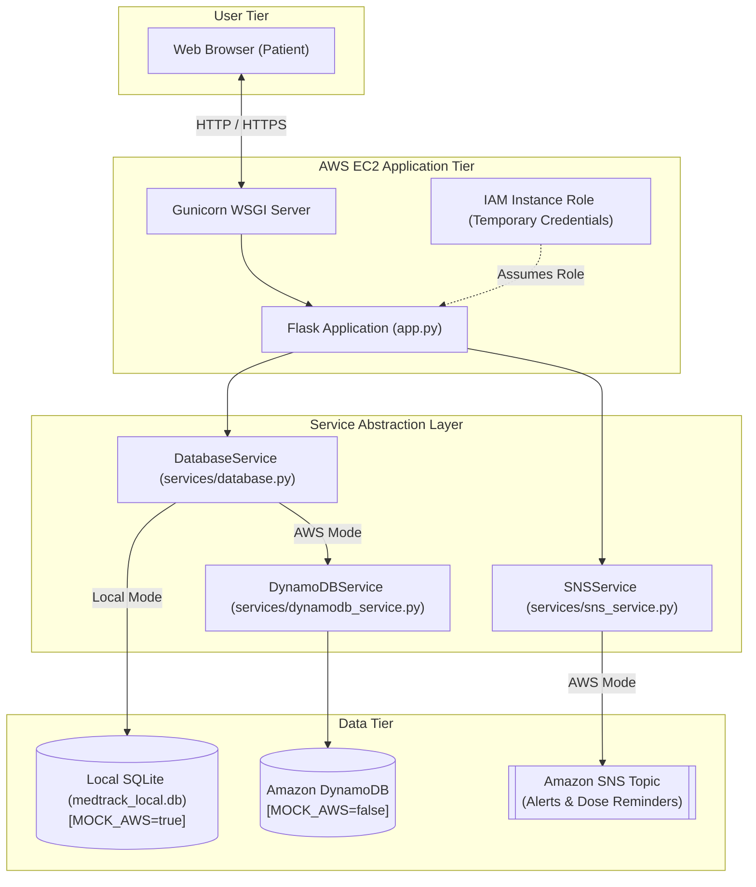

# MedTrack – Comprehensive Project Audit & Architecture Consolidation Plan

**Audit Date:** September 19, 2026  
**Project:** MedTrack – AWS Cloud-Enabled Medicine & Healthcare Management System  
**Auditor:** Antigravity AI  

---

## 1. Executive Summary & Purpose

The target system is **MedTrack: A Medicine & Healthcare Tracking System with Medicine Management as the Primary Feature**.  
The primary real-world use case centers on an individual (such as an elderly patient or a patient managing chronic conditions) who must reliably manage daily prescriptions and dosages (e.g. 08:00 AM, 02:00 PM, 08:00 PM), receive actionable reminders, log compliance (**TAKEN**, **SKIPPED**, **MISSED**), and maintain an unalterable history. Complementary modules for appointments, doctors, prescriptions, diagnoses, and medical reports support this core workflow without transforming the system into an administrative hospital EHR.

This audit evaluates the codebase against that mission, establishes an inventory of all existing assets, identifies obsolete or hospital-specific relics, detects missing requirements, audits security posture, and lays out a refactoring and consolidation roadmap.

---

## 2. Existing Architecture Overview



---

## 3. Inventory of Existing Project Files

| Path | Purpose / Category | Status | Notes |
| :--- | :--- | :--- | :--- |
| `app.py` | Flask Web Application & Routes | **Refactor** | 814 lines; mix of patient medicine logic and legacy doctor workspace routes. Needs consolidation into unified MedTrack modules. |
| `config.py` | Environment & AWS Configuration | **Refactor** | Solid foundation; needs table names for `Doctors`, `Prescriptions`, `Reports`. |
| `requirements.txt` | Python Dependencies | **Keep** | Clean minimal dependencies (`Flask`, `python-dotenv`, `boto3`, `Werkzeug`, `gunicorn`). |
| `Procfile` | WSGI Process Declaration | **Keep** | Standard `web: gunicorn app:app` (works on EC2 systemd/Procfile runners). |
| `render.yaml` | Render Deployment Config | **Remove** | EC2 is the single target cloud platform. Render is obsolete. |
| `.gitignore` | Git Exclusion Rules | **Keep / Refine** | Properly ignores `.env`, `*.db`, `venv/`, `uploads/*`. |
| `.env` | Local Environment Secrets | **Keep Local** | Properly ignored; NEVER tracked by git. |
| `.env.example` | Template Configuration | **Refactor** | Update with complete DynamoDB table placeholders. |
| `README.md` | Primary Project Documentation | **Refactor** | Needs comprehensive rewrite reflecting the medicine-first architecture. |
| `services/database.py` | Dual Database Abstraction Layer | **Refactor** | Expand SQLite schema with `doctors`, `prescriptions`, `reports`, `caregiver` fields. |
| `services/dynamodb_service.py` | AWS DynamoDB boto3 Driver | **Refactor** | Add support for `doctors`, `prescriptions`, `reports`, and `missed` status queries. |
| `services/sns_service.py` | Amazon SNS Event Messaging | **Refactor** | Standardize reusable functions: `send_medicine_reminder`, `send_missed_medicine_notification`, `send_appointment_reminder`. |
| `static/css/style.css` | Design System & Styling | **Keep / Polish** | 22KB clean vanilla CSS; high visual hierarchy, readable fonts for elderly users. |
| `static/js/script.js` | Client-side Micro-interactions | **Keep** | Auto-dismiss alerts, min date constraints. |
| `static/img/` | UI Visual Assets | **Keep** | Healthcare banner image. |
| `templates/base.html` | Master Shell & Navigation | **Refactor** | Streamline sidebar navigation to match unified patient healthcare workflow. |
| `templates/icons.html` | Inline SVG Icon Macro Suite | **Keep** | Zero CDN dependency vector icons. |
| `templates/index.html` | Public Home Page | **Keep / Polish** | Modern landing presentation. |
| `templates/login.html` | Authentication Portal | **Keep** | Role selection & credentials form. |
| `templates/register.html` | Registration Portal | **Refactor** | Add optional caregiver / emergency contact fields. |
| `templates/dashboard.html` | Primary Dashboard | **Refactor** | Center around Today's Medicines ([TAKE] [SKIP]), Upcoming Visit, Recent History, and Live Notifications. |
| `templates/medicines.html` | Medicine Cabinet Inventory | **Keep / Enhance** | Active prescriptions list with status toggles and test reminders. |
| `templates/medicine_form.html` | Add/Edit Medication Form | **Refactor** | Add start/end date, instructions, quantity, active toggle, and edit mode support. |
| `templates/patient_schedule.html`| Daily Dose & Visit Schedule | **Keep / Enhance**| Calendar agenda with dose compliance checklist. |
| `templates/history.html` | Medication Intake Audit History | **Keep / Enhance**| Add filtering by date, medicine name, and status (TAKEN/SKIPPED/MISSED). |
| `templates/appointments.html` | Patient Appointments List | **Keep / Polish** | Status filter tabs, cancellation workflow. |
| `templates/appointment.html` | Book / Edit Appointment Form | **Keep / Polish** | Add doctor dropdown selector and location field. |
| `templates/doctors_search.html` | Doctor Directory & Management | **Refactor** | Allow patient to view saved doctors, add new doctor contact, and initiate bookings. |
| `templates/diagnoses.html` | Patient Medical Records | **Keep / Enhance** | View clinical condition entries and notes. |
| `templates/diagnosis.html` | Clinical Diagnosis Entry Form | **Keep / Polish** | Record medical conditions and doctor consultation notes. |
| `templates/notifications.html` | Alerts & Reminders Inbox | **Keep / Polish** | View SNS-dispatched notifications. |
| `templates/profile.html` | Patient Profile & Caregiver | **Refactor** | Add emergency contact and caregiver fields. |
| `templates/doctor_dashboard.html` | Attending Physician Console | **Refactor / Consolidate** | Retain for demo evaluation without hospital billing or inpatient overhead. |
| `templates/doctor_schedule.html` | Physician Consultation Agenda | **Refactor / Consolidate** | Retain for demonstration. |
| `templates/doctor_patients.html` | Physician Patient Directory | **Refactor / Consolidate** | Retain for demonstration. |
| `templates/doctor_reports.html` | Diagnostic Reports Archive | **Refactor / Consolidate** | Wire into unified patient medical report viewer. |
| `templates/doctor_prescriptions.html`| Prescriptions Directory | **Refactor / Consolidate**| Wire into patient prescription manager with "Add to Schedule" action. |
| `templates/doctor_notifications.html`| Physician Alert Feed | **Refactor / Consolidate** | Retain for evaluation. |
| `templates/doctor_profile.html` | Physician Credentials | **Refactor / Consolidate** | Retain for evaluation. |
| `tests/test_app.py` | Automated Unit Test Suite | **Refactor** | 21 existing tests; expand to cover edit medicine, missed medicine logic, caregiver alert, and filter queries. |
| `scripts/verify_live_e2e.py` | Live HTTP Verification Script | **Keep** | Tests live browser session cookies against server. |
| `aws/cloudformation.yaml` | AWS Infrastructure as Code | **Refactor** | Update to provision all 9 DynamoDB tables, SNS Topic, IAM Role, and EC2 instance. |
| `aws/terraform/main.tf` | Terraform Alternative IaC | **Refactor** | Add missing DynamoDB tables (`Medicines`, `IntakeLogs`, `Doctors`, `Prescriptions`, `Reports`). |
| `docs/architecture.md` | Architecture Documentation | **Refactor** | Update diagrams and entity descriptions. |
| `docs/ER-Diagram.md` | Entity Relationship Diagram | **Refactor** | Update Mermaid ER diagram to reflect the 9 DynamoDB persistence tables alongside Schedule as a logical scheduling entity. |

---

## 4. Gap Analysis & Findings

### A. What is Already Implemented Correctly
1. **Flask Core & Authentication**: Registration, Werkzeug scrypt password hashing (salted key derivation via `generate_password_hash` / `check_password_hash`), login sessions, logout, role decorators (`@patient_required`, `@doctor_required`).
2. **Dual-Mode Abstraction**: Seamless fallback between `medtrack_local.db` (SQLite) and AWS DynamoDB via `Config.MOCK_AWS`.
3. **Medicine Tracker Basics**: Adding medicine, listing in cabinet, deleting medicine, and dispatching simulated SNS reminders.
4. **Intake Logging & History**: Recording TAKEN / SKIPPED statuses with timestamps into persistent storage, and rendering history audit table with adherence metrics.
5. **Clean Zero-CDN UI**: Lightweight vanilla CSS design system, typography, and inline SVG macro library ([icons.html](file:///c:/Users/Admin/Documents/MedTrack/templates/icons.html)).
6. **Git Hygiene**: `.env` is unversioned and strictly ignored in `.gitignore`. Local database files are ignored.

### B. What is Partially Implemented
1. **Medicine Schedule Statuses**: Currently tracks `PENDING`, `TAKEN`, `SKIPPED`. Missing `UPCOMING`, `DUE`, and `MISSED` logic.
2. **Missed Medicine Logic**: No automatic or manual transition of unacknowledged doses past the scheduled window into `MISSED`, and no caregiver alert dispatch.
3. **Medicine Editing**: Only `create_medicine` and `delete_medicine` exist; editing an existing medicine record (`/medicines/<id>/edit`) is missing.
4. **Doctor Management**: Doctors exist only as pre-seeded demo rows in `users`. The patient cannot add their own primary care doctor or specialist contact details.
5. **Prescription Workflow**: Prescriptions are listed in a static doctor template, but lack a patient-facing view with an "Add to Medicine Schedule" 1-click action.
6. **Medical Reports**: Document records exist in demo templates but lack dedicated patient upload/viewing and metadata tracking.
7. **History Filtering**: The `history.html` view displays logs in chronological order, but lacks filter dropdowns for date range, specific medicine, or status.
8. **Caregiver / Emergency Contact**: Profile template only has DOB and phone; lacks emergency contact name/phone and caregiver alerting.

### C. What Belongs to Old Healthcare/Hospital Concept
1. **Hospital Billing / Inpatient EHR Language**: Phrases in `aws/cloudformation.yaml` ("Enterprise Hospital EHR & Cloud Management Platform") and older references to HIPAA hospital compliance that don't match personal medicine tracking.
2. **Render Cloud Config**: `render.yaml` was added for Render hosting, which conflicts with the AWS EC2 production architecture requirement.

### D. AWS & Infrastructure Issues
1. **DynamoDB Tables Out of Sync**: `aws/terraform/main.tf` and `aws/cloudformation.yaml` only declare `Users`, `Appointments`, `Diagnoses`, `Notifications`, and `AuditLogs`. They are missing `MedTrack_Medicines`, `MedTrack_IntakeLogs`, `MedTrack_Doctors`, `MedTrack_Prescriptions`, and `MedTrack_MedicalReports`.
2. **SNS Method Names**: `services/sns_service.py` has `notify_dose_reminder` and `notify_appointment_booked`, but the specification calls for clean standard functions: `send_medicine_reminder`, `send_missed_medicine_notification`, and `send_appointment_reminder`.
3. **Scheduler Mechanism**: Amazon SNS is an event publisher, not a scheduler. In production EC2, cron / systemd timer or AWS EventBridge is required to invoke due-dose checks. This must be clearly documented.

### E. Security Audit Findings
1. **Credentials**: ZERO hardcoded AWS access keys or secret keys found in the repository. All calls use boto3 default credential chain / IAM instance profile.
2. **Environment Variables**: `.env` is absent from git tracking. `.env.example` contains safe dummy values.
3. **Password Security**: Passwords hashed using Werkzeug (`generate_password_hash` / `check_password_hash` using `scrypt` cryptographic key derivation with per-user salt; plaintext passwords are never stored).
4. **Session Security**: `SESSION_COOKIE_HTTPONLY=True`, `SESSION_COOKIE_SAMESITE="Lax"`, and configurable `SESSION_COOKIE_SECURE`.
5. **Data Isolation**: Patient can only access their own appointments, medicines, intake logs, and diagnosis records (enforced in `services/database.py` and `app.py`).

---

## 5. File Cleanup Plan

| File | Proposed Action | Reason | Referenced By | Replacement / Handling |
| :--- | :--- | :--- | :--- | :--- |
| `render.yaml` | **REMOVE** | Conflicting deployment target; production target is strictly AWS EC2. | None | Documented in `docs/EC2-DEPLOYMENT.md` |
| `uploads/patient-jane-doe_*.pdf` | **REMOVE (Local temp)** | 15 synthetic PDF files generated during previous local test runs. Already ignored by git. | None | Keep `uploads/.gitkeep` only |
| `aws/terraform/main.tf` | **REFACTOR** | Missing `Medicines` and `IntakeLogs` DynamoDB table definitions. | AWS deployment | Update with all MedTrack tables |
| `aws/cloudformation.yaml` | **REFACTOR** | Remove obsolete hospital EHR descriptions and add missing DynamoDB tables. | AWS deployment | Consolidated CloudFormation template |
| `services/database.py` | **REFACTOR** | Add fields for Caregiver, Medicine Instructions/Dates, Doctors, Prescriptions, Reports. | `app.py`, `tests` | Extended schema & helper methods |
| `services/sns_service.py` | **REFACTOR** | Standardize reusable functions (`send_medicine_reminder`, `send_missed_medicine_notification`, etc.). | `app.py`, `tests` | Cleaned SNS service layer |
| `app.py` | **REFACTOR** | Complete Medicine CRUD (edit), Schedule status logic (UPCOMING/DUE/TAKEN/SKIPPED/MISSED), History filtering, Prescriptions-to-schedule conversion, Caregiver alerts. | Flask server | Consolidated single application |
| `templates/base.html` | **REFACTOR** | Streamlined navigation matching final MedTrack modules. | All templates | Unified patient navigation |
| `templates/dashboard.html` | **REFACTOR** | Focused Medicine-first layout: Today's Doses ([TAKE]/[SKIP]), Upcoming Visit, Recent History, Alerts. | `app.py` | Clean elderly-friendly dashboard |
| `templates/medicine_form.html`| **REFACTOR** | Support both Add and Edit modes with complete fields (instructions, dates, quantity, notes). | `app.py` | Reusable medicine form |
| `templates/history.html` | **REFACTOR** | Add interactive status/date filtering for historical doses. | `app.py` | Filterable history table |
| `templates/profile.html` | **REFACTOR** | Add emergency contact and caregiver fields. | `app.py` | Enhanced profile editor |

---

## 6. Recommended Final Architecture

```
User (Patient / Caregiver)
         │
         ▼
  Amazon EC2 Instance (Amazon Linux 2023)
  ├── Nginx (Reverse Proxy Port 80 -> 5000)
  ├── Systemd Service (gunicorn app:app)
  └── IAM Instance Role (MedTrack-EC2-Role)
         │
         ├─────────────────────────────────────────┐
         ▼                                         ▼
Amazon DynamoDB (NoSQL Data Tier — 9 Tables)    Amazon SNS (Notification Engine)
  ├── MedTrack_Users (1)                          └── Topic: MedTrack-Alerts
  ├── MedTrack_Medicines (2)                            ├── Patient Email / SMS
  ├── MedTrack_IntakeLogs (3)                           └── Caregiver Email / SMS
  ├── MedTrack_Appointments (4)
  ├── MedTrack_Doctors (5)
  ├── MedTrack_Prescriptions (6)
  ├── MedTrack_Diagnoses (7)
  ├── MedTrack_Reports (8)
  └── MedTrack_Notifications (9)

*Note on Architecture Consistency: Physical persistence is partitioned across 9 DynamoDB tables. "Schedule" is maintained as a logical scheduling entity and runtime evaluation concept derived from medicine recurrence rules and current clock time, rather than a decoupled 10th database table.*
```

---

## 7. Deep-Dive Audit & Architectural Specifications (Addendum)

This section incorporates 10 critical operational, architectural, and security audit criteria into the MedTrack project baseline:

### 1. SNS vs. Scheduler Disambiguation
- **Amazon SNS Role**: Amazon SNS is purely a publish-subscribe notification fan-out service (dispatching emails and SMS messages). It contains **no scheduling mechanism, timer, or cron daemon**.
- **Reminder Evaluation Mechanism**: Determining when a medicine is DUE or MISSED requires an active polling/evaluator process. 
- **EC2 Execution Strategy**:
  - **Option A (Systemd Timer / Linux Cron)**: A lightweight CLI worker (`python -m services.scheduler_worker`) executed every 5 to 10 minutes on EC2 via a `medtrack-scheduler.timer` systemd unit.
  - **Option B (In-Process Background Thread)**: A daemon background thread using `APScheduler` initialized within the WSGI process that periodically checks today's schedules against the current system time.
  - **AWS Serverless Alternative**: An Amazon EventBridge Scheduled Rule (cron) triggering an AWS Lambda function or hitting an authenticated internal webhook on the EC2 instance.

### 2. Medicine / Schedule / Intake Log Entity Separation
A clear structural separation must be maintained between identity, timing, and actual clinical compliance:
- **Medicine**: The static pharmaceutical entity persisted in `MedTrack_Medicines` (`medicine_id`, `patient_id`, `name`, `dosage`, `instructions`, `start_date`, `end_date`, `quantity`, `is_active`, `notes`).
- **Schedule**: The **logical scheduling entity and runtime concept** defining *when* intake should occur (`medicine_id`, `schedule_time`, `frequency`, `meal_timing`). It is computed from medication rules and target time slots rather than requiring an isolated 10th DynamoDB table.
- **Intake Log**: The historical audit transaction of *what actually happened*, persisted in `MedTrack_IntakeLogs` (`log_id`, `patient_id`, `medicine_id`, `scheduled_date`, `scheduled_time`, `taken_time`, `status`, `created_at`).
- **Runtime State Engine**:
  - `UPCOMING` and `DUE` are **dynamically calculated** at runtime by comparing the current clock time against `schedule_time` for active medications where no intake log exists for that specific dose window today. They are **never** stored as static historical database records.
  - `TAKEN`, `SKIPPED`, and `MISSED` are the only permanent, unalterable historical outcomes persisted to `MedTrack_IntakeLogs`.

### 3. Complete User Data Isolation
Every data-access method and route must strictly enforce single-tenant tenancy scoped to the authenticated session (`g.user["user_id"]`):
1. **Medicines**: Read/Write/Delete scoped strictly by `patient_id = current_user.id`.
2. **Schedules**: Computed exclusively from the authenticated user's active prescriptions.
3. **Intake Logs**: Intake history queries strictly filtered by `patient_id = current_user.id`.
4. **Appointments**: Access, booking, and cancellations restricted to user's own appointments.
5. **Doctors**: Private physician directory records scoped to the user.
6. **Prescriptions**: Prescription archives filtered strictly by `patient_id`.
7. **Diagnoses**: Medical assessment records isolated strictly by `patient_id`.
8. **Reports**: Medical report metadata and document references inaccessible across accounts.
9. **Notifications**: In-app alert inbox filtered exclusively by `patient_id`.
10. **Profile**: Account settings modifications permitted only for the logged-in user.
11. **Caregiver Information**: Emergency contact and caregiver phone/email sequestered within the owner's profile.

### 4. CSRF Protection on State-Changing Operations
All state-modifying HTTP POST / PUT / DELETE endpoints must be guarded against Cross-Site Request Forgery:
- **Impacted Routes**:
  - Medicine management: `/medicines/new`, `/medicines/<id>/edit`, `/medicines/<id>/delete`
  - Dose compliance actions: `/medicines/intake/log` ([TAKE] / [SKIP])
  - Appointments: `/appointments/new`, `/appointments/<id>/cancel`
  - Saved doctors: `/doctors/new`, `/doctors/<id>/delete`
  - Prescriptions, diagnoses, and medical reports creation
  - Profile & caregiver updates: `/profile`
- **Mitigation Pattern**: Integrate `Flask-WTF` (`CSRFProtect(app)`) injecting unique cryptographic CSRF tokens into all Jinja form submissions, complemented by `SameSite=Lax` cookies.

### 5. Duplicate Reminder & Intake Prevention
- **Intake Deduplication**: To support multi-dose regimens per day (such as 08:00 AM morning, 02:00 PM afternoon, and 08:00 PM evening doses of the same medication), logging intake must follow an idempotent upsert pattern constrained by the specific scheduled dose identity: `(patient_id, medicine_id, scheduled_date, scheduled_time)` or an equivalent `schedule_id`-based design. This ensures that morning, afternoon, and evening doses cannot collide or overwrite one another, while guaranteeing that repeated clicks or duplicate submissions for the same scheduled dose window update the existing entry in-place instead of creating duplicate historical rows.
- **Reminder Deduplication**: Before dispatching an Amazon SNS reminder, the scheduler checks an idempotency ledger (or checks whether an alert for `(patient_id, medicine_id, scheduled_date, scheduled_time)` was already logged in `MedTrack_Notifications`). Multiple scheduler runs within the same due window will not spam the patient with repeated emails or SMS messages.

### 6. Caregiver Authorization & Information Minimization
- **Information Minimization**: Emergency caregiver alerts dispatched via SNS (for missed doses or urgent notifications) must contain **only** essential operational details:
  - Patient's name
  - Medication name & dosage
  - Scheduled intake time
  - Notification reason (e.g., *"Scheduled dose of Amlodipine 5mg was not acknowledged within 60 minutes"*).
- **Access Boundary**: The caregiver does **not** receive a direct authentication token, login session, or blanket access to browse confidential clinical diagnoses, consultation notes, or medical history.

### 7. Production Session Security
- **HTTPOnly Flag**: `SESSION_COOKIE_HTTPONLY=True` prevents client-side scripts from accessing session tokens, mitigating XSS token theft.
- **SameSite Flag**: `SESSION_COOKIE_SAMESITE="Lax"` blocks third-party cross-site request embedding.
- **Secure Flag**: Configured via `Config.SESSION_COOKIE_SECURE` (`os.getenv("SESSION_COOKIE_SECURE")`). In production when HTTPS/TLS is enabled on EC2 (via ALB or Nginx with Let's Encrypt), this evaluates to `True`, ensuring cookies are never transmitted over unencrypted HTTP.

### 8. Local Database vs. Cloud Production Separation
- **Offline Mock Isolation**: `medtrack_local.db` is strictly an offline development convenience for running without AWS credentials (`MOCK_AWS=true`).
- **Production Truth**: When `MOCK_AWS=false`, the `DatabaseService` delegates 100% of data operations to `DynamoDBService` (boto3). `medtrack_local.db` is never opened, read, or modified in production mode. DynamoDB is the sole, authoritative source of truth.

### 9. IAM Least-Privilege Policy
The EC2 IAM Instance Role (`MedTrack-EC2-Role`) must strictly avoid `AdministratorAccess` or wildcard `Resource: "*"`. Permissions must be granularly scoped:
- **DynamoDB Actions**: `dynamodb:GetItem`, `dynamodb:PutItem`, `dynamodb:UpdateItem`, `dynamodb:DeleteItem`, `dynamodb:Query`, `dynamodb:Scan`, `dynamodb:BatchGetItem`.
  - **Resource**: `arn:aws:dynamodb:*:*:table/MedTrack_*`
- **SNS Actions**: `sns:Publish`.
  - **Resource**: `arn:aws:sns:*:*:MedTrack-Alerts`
- **STS**: Implicitly handles temporary rotating credentials via EC2 metadata service (`IMDSv2`).

### 10. Scheduler Failure & Restart Handling
- **Downtime Recovery**: If the EC2 instance reboots or the scheduler service temporarily crashes, upon restarting, the scheduler immediately executes a recovery catch-up:
  1. Identifies any scheduled doses whose time window passed during downtime without an intake log.
  2. Flags eligible unacknowledged doses past the configured threshold as `MISSED`.
  3. Records a single consolidated catch-up notification in `MedTrack_Notifications`.
- **Idempotency Guard**: Any dose already marked `TAKEN` or `SKIPPED` before the crash remains untouched, preventing false missed-dose alarms.
