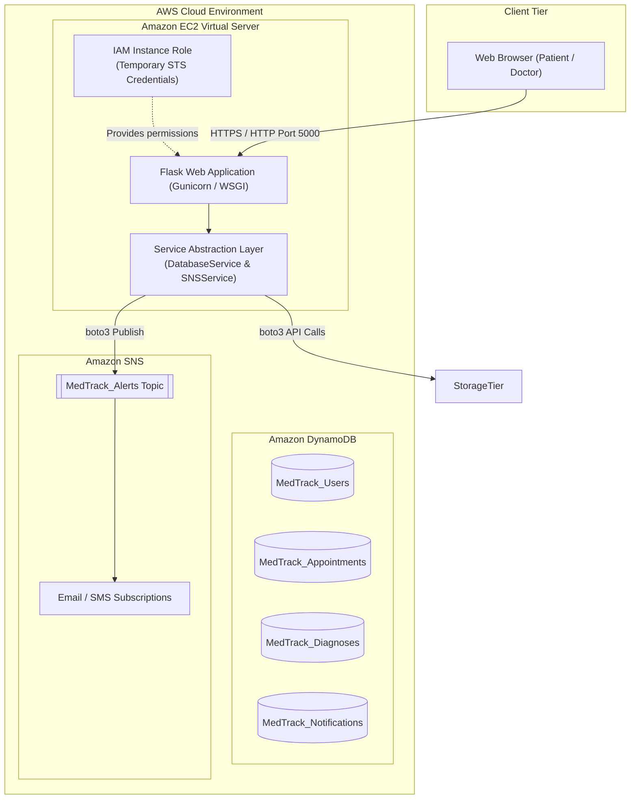
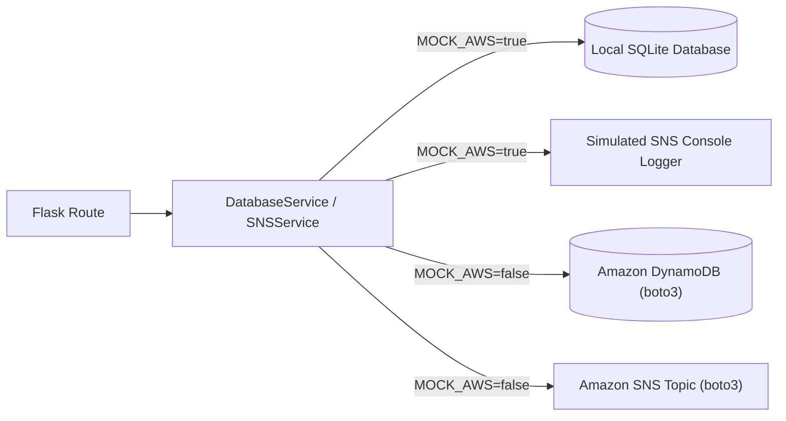

# MedTrack Cloud Architecture & System Design

## 1. Executive Summary
MedTrack is a student demonstration healthcare management web application engineered for the **AWS Cloud Practitioner / SkillWallet** capstone project. The application demonstrates modern cloud integration principles:
- **Compute**: Web tier hosted on an **AWS EC2** instance running Python Flask.
- **Database**: NoSQL persistence powered by **Amazon DynamoDB**.
- **Messaging**: Event-driven notification dispatch via **Amazon SNS**.
- **Security**: Principle of least privilege enforced through an **AWS IAM Instance Role** (zero hardcoded credentials).

---

## 2. Cloud Architecture Diagram



---

## 3. Core Architecture Principles

### 3.1 Service Abstraction Layer (Dual-Mode Execution)
The application code does not tightly couple Flask routes to AWS APIs. Instead, it interacts through repository interfaces defined in `services/`:



- **Local Mode (`MOCK_AWS=true`)**:
  Used during Phase 1 local development and testing. SQLite stores relational data locally (`medtrack_local.db`), and SNS messages are formatted and logged to standard output without requiring AWS credentials or internet access.
- **AWS Mode (`MOCK_AWS=false`)**:
  Used when deployed to an AWS EC2 instance. The application connects directly to Amazon DynamoDB and Amazon SNS using `boto3`.

### 3.2 IAM Instance Role Access Control
In compliance with AWS security best practices:
- **No permanent AWS access keys** (`AWS_ACCESS_KEY_ID` or `AWS_SECRET_ACCESS_KEY`) are stored in application source code or version control.
- When running on EC2, the instance assumes an **IAM Role** attached via an instance profile.
- `boto3` automatically retrieves short-lived temporary security credentials from the EC2 instance metadata service (IMDSv2).

**Sample IAM Policy (`MedTrackAppPolicy`):**
```json
{
  "Version": "2012-10-17",
  "Statement": [
    {
      "Sid": "DynamoDBTableAccess",
      "Effect": "Allow",
      "Action": [
        "dynamodb:GetItem",
        "dynamodb:PutItem",
        "dynamodb:UpdateItem",
        "dynamodb:DeleteItem",
        "dynamodb:Scan",
        "dynamodb:Query"
      ],
      "Resource": "arn:aws:dynamodb:*:*:table/MedTrack_*"
    },
    {
      "Sid": "SNSTopicPublishAccess",
      "Effect": "Allow",
      "Action": [
        "sns:Publish"
      ],
      "Resource": "arn:aws:sns:*:*:MedTrack_Alerts"
    }
  ]
}
```

---

## 4. Amazon SNS Event Triggers

The system publishes automated notifications to the `MedTrack_Alerts` SNS topic during four specific clinical workflow events:

| Event ID | Workflow Action | Trigger Source | Recipient |
|---|---|---|---|
| **1. Appointment Booked** | Patient submits a booking request | `POST /appointments/new` | Patient & Doctor notification log |
| **2. Appointment Confirmed** | Doctor confirms a pending appointment | `POST /doctor/appointments/<id>/status` | Patient alert |
| **3. Appointment Cancelled** | Patient or Doctor cancels visit | `POST /appointments/<id>/cancel` | Patient alert |
| **4. Diagnosis Submitted** | Doctor finalizes clinical notes | `POST /doctor/diagnosis/new/<id>` | Patient record update alert |

---

## 5. Security & Session Integrity
- **Password Hashing**: Werkzeug's secure PBKDF2/SHA-256 algorithm with random salt ensures no plaintext passwords exist in memory or storage.
- **Cookie Hardening**: `SESSION_COOKIE_HTTPONLY=True` prevents cross-site scripting (XSS) session theft; `SESSION_COOKIE_SAMESITE="Lax"` mitigates CSRF attacks.
- **Strict Role-Based Authorization (RBAC)**: Custom decorators (`@login_required`, `@patient_required`, `@doctor_required`) guard all sensitive endpoints.
- **Cross-Patient Isolation**: Every appointment and diagnosis query explicitly filters by the authenticated user's ID, preventing horizontal privilege escalation.
